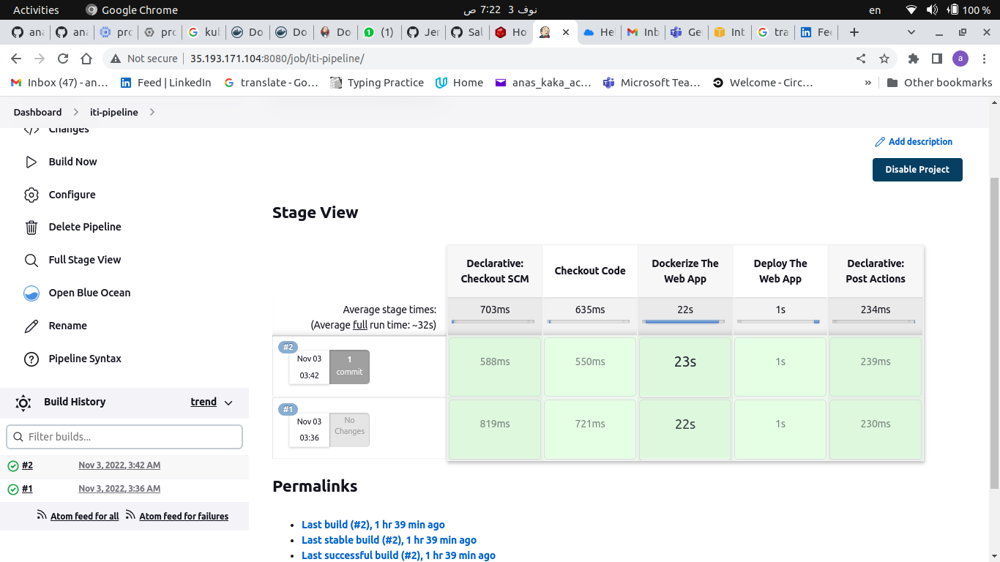
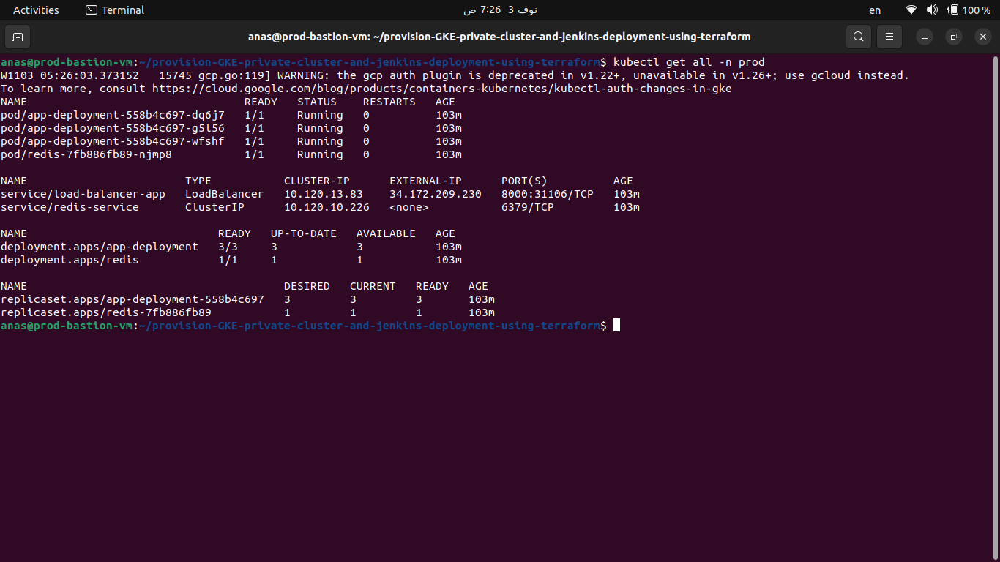
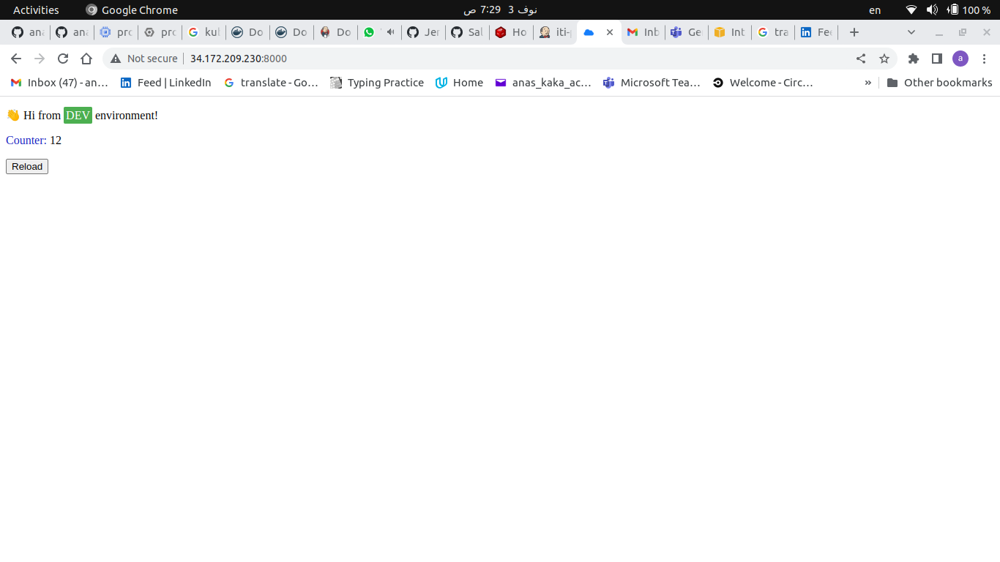

# Deploying Python-Redis Web Application On a Private GKE Cluster

This Is Part Two

Part One: https://github.com/anas1243/provision-GKE-private-cluster-and-jenkins-deployment-using-terraform

This Project aimed to Deploy A containerized python-Redis web application on A GKE private cluster with jenkins deployment on another namespace

## Steps applied

### Dockerize The Web Application

1. Cloned the demo app repo from github

- `git clone https://github.com/atefhares/DevOps-Challenge-Demo-Code.git`

2. Made the docker file after reading the documentation carefully
3. Built,auth, and push the application image on gci and docker hub

- `docker build . -t gcr.io/red-forklift-366019/iti-gcp-project`
- `docker build . -t anas1243/python-redis-app`

- `gcloud auth configure-docker`
- `docker login`

- `docker push gcr.io/red-forklift-366019/iti-gcp-project`
- `docker push anas1243/python-redis-app`

### Deploy The Application

1. Signed in To `jenkins dashboard` using the `External IP` of the `loadbalancer` that is mention in project number one

- 

2. Added Docker Credintials

- 

3. Configured A Pipeline with a remote `Jenkinsfile`

- 

4. Run The Pipeline

- 

5. Got External `Application loadbalancer IP` from another `namespace`

- 

6. Hit The Python-Redis Web Application

- 

### Notice: The Following Repo Containing The Jenkins Deployment on the private GKE cluster

Repo: https://github.com/anas1243/provision-GKE-private-cluster-and-jenkins-deployment-using-terraform
